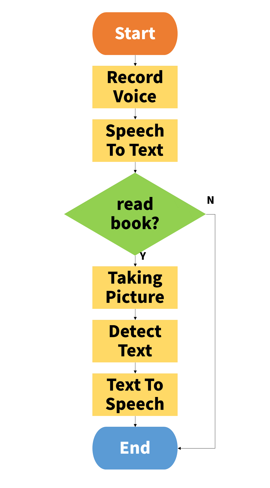

# A Project on the speech conversion system of the informal document

Writing is a form of information that has contributed greatly to the explosive growth of mankind. <br/>
However, there are people who have difficulty accessing information(Writing) that is visually provided, <br/>
such as illiterate or visually impaired. <br/>
In this Project, I tried to implement a system that converts non-standard documents to speech and outputs them. <br/>
글이란 인류가 폭발적으로 성장하는데 큰 기여를 한 정보 전달 형태다. <br/>
그러나 문맹, 시각장애인 등 시각적으로 제공되는 글에 대한 접근이 어려운 사람들은 우리 주변에 존재한다. <br/>
본 프로젝트에서는 이들을 위해 비정형화된 형태의 문서라도 음성으로 변환해 출력하는 시스템을 만들려고 하였다. <br/><br/>

# 1. Setting up the Raspberry Pie for Development

A. Installing the USB Microphone <br/>
(link) http://makeshare.org/bbs/board.php?bo_table=raspberrypi&wr_id=76 <br/><br/>

B. Configure and Test the Audio <br/>
(link) https://developers.google.com/assistant/sdk/guides/library/python/embed/audio <br/><br/>

C. Recording a voice file with the extension raw <br/>
(link) https://github.com/larsimmisch/pyalsaaudio <br/><br/>

D. Installing the camera in a raspberry pie and Taking Pictures <br/>
(link) https://kocoafab.cc/tutorial/view/334 <br/>
```{.python}
from picamera import PiCamera
from time import sleep

camera = PiCamera()
camera.start_preview()
sleep(7)
camera.capture(imgDir)
camera.stop_preview()
```

# 2. Google Speech-to-Text Client Libraries
(link) https://cloud.google.com/speech-to-text/docs/reference/libraries?hl=ko#client-libraries-install-python 
```{.python}
import io
import os

# Imports the Google Cloud client library
from google.cloud import speech
from google.cloud.speech import enums
from google.cloud.speech import types

# Instantiates a client
client = speech.SpeechClient()

# The name of the audio file to transcribe
file_name = os.path.join(
    os.path.dirname(__file__),
    'resources',
    'audio.raw')

# Loads the audio into memory
with io.open(file_name, 'rb') as audio_file:
    content = audio_file.read()
    audio = types.RecognitionAudio(content=content)

config = types.RecognitionConfig(
    encoding=enums.RecognitionConfig.AudioEncoding.LINEAR16,
    sample_rate_hertz=16000,
    language_code='en-US')

# Detects speech in the audio file
response = client.recognize(config, audio)

for result in response.results:
    print('Transcript: {}'.format(result.alternatives[0].transcript))
```

# 3. Google Optical character recognition Client Libraries
(link) https://cloud.google.com/vision/docs/detecting-text?hl=ko 
```{.python}
def detect_text_uri(uri):
    """Detects text in the file located in Google Cloud Storage or on the Web.
    """
    from google.cloud import vision
    client = vision.ImageAnnotatorClient()
    image = vision.types.Image()
    image.source.image_uri = uri

    response = client.text_detection(image=image)
    texts = response.text_annotations
    print('Texts:')

    for text in texts:
        print('\n"{}"'.format(text.description))

        vertices = (['({},{})'.format(vertex.x, vertex.y)
                    for vertex in text.bounding_poly.vertices])

        print('bounds: {}'.format(','.join(vertices)))
```

# 4. AWS Text-to-Speech Client Libraries
(link) https://youtu.be/nxzAb9r-u5A <br/>

A. Create a free account <br/>
(link) https://aws.amazon.com <br/><br/>

B. Install Python 3.5 (boto3 available only in Python 3) <br/>
``` $ sudo apt-get install python3.5``` <br/><br/>

C. Write and run the code <br/>
``` $ python3 tts_eng.py``` 
```{.python}
import boto3
from pygame import mixer
polly = boto3.client('polly')
spoken_text = polly.synthesize_speech(Text="Hello, We are Testing TTS",
                                  OutputFormat='mp3',
                                  VoiceId='Seoyeon')
with open(outDir, 'wb') as f:
    f.write(spoken_text['AudioStream'].read())
    f.close()

# audio play
mixer.init()
mixer.music.load(outDir)
mixer.music.play()
while mixer.music.get_busy() == True:
    continue
```

# 5. Merge the all code
Check the [readingmachine_ver1.py](https://github.com/Song-Hea-mi/ReadingMachine/blob/master/readingmachine_ver1.py) code <br/>

